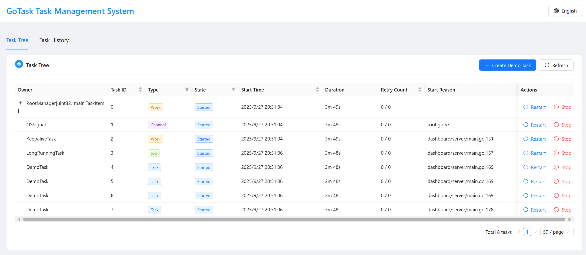

# GoTask
<div align="center">
  
</div>

[中文文档](README_CN.md) | English

[](https://golang.org/)
[](https://opensource.org/licenses/MIT)
[](https://goreportcard.com/report/github.com/langhuihui/gotask)
[](https://godoc.org/github.com/langhuihui/gotask)

> An asynchronous task management framework based on Go language, providing precise control capabilities similar to an operating system task manager

## Table of Contents

- [Project Purpose](#project-purpose)
  - [Core Philosophy](#core-philosophy)
  - [Core Problems Solved](#core-problems-solved)
  - [Nine Core Features](#nine-core-features)
  - [Use Cases](#use-cases)
- [Quick Start](#quick-start)
  - [Installation](#installation)
  - [Build Options](#build-options)
  - [Basic Usage](#basic-usage)
  - [RootManager Usage Guide](#rootmanager-usage-guide)
  - [Dashboard](#dashboard)
- [AI IDE Rules](#ai-ide-rules)
- [Project Structure](#project-structure)
- [Features](#features)
  - [Nine Core Features](#nine-core-features-1)
- [Usage Guide](#usage-guide)
  - [Conditional Compilation Parameters](#conditional-compilation-parameters)
  - [Task Startup](#task-startup)
  - [EventLoop Mechanism](#eventloop-mechanism)
  - [Task Stopping](#task-stopping)
- [Task Management API](#task-management-api)
  - [Task Public Methods](#task-public-methods)
  - [Job Public Methods](#job-public-methods)
  - [Global Functions](#global-functions)
  - [Race Condition Handling](#race-condition-handling)
- [Dashboard](#dashboard-1)
  - [Backend Service (dashboard/server)](#backend-service-dashboardserver)
  - [Frontend Interface (dashboard/web)](#frontend-interface-dashboardweb)
  - [Quick Start](#quick-start-1)
  - [One-click Startup](#one-click-startup)
- [Tutorial Lessons](#tutorial-lessons)
  - [Course Structure](#course-structure)
  - [How to Use the Lessons](#how-to-use-the-lessons)
  - [Course Features](#course-features)
  - [Learning Recommendations](#learning-recommendations)
  - [Course List](#course-list)
- [Contribution](#contribution)
  - [Contribution Methods](#contribution-methods)
- [License](#license)
- [Acknowledgements](#acknowledgements)
- [Related Links](#related-links)
- [Support](#support)

## Project Purpose

GoTask is an asynchronous task management framework based on Go language, designed to solve task management challenges in complex projects. We believe that **everything is a task**, whether it's network connections, data processing, scheduled tasks, or business processes, all can be abstracted as tasks for unified management.

### Core Philosophy

**Everything is a Task** - Breaking down complex business logic into manageable task units, each with a clear lifecycle, execution path, and resource management. This design philosophy makes the system architecture clearer, code more maintainable, and issues easier to locate.

**OS-like Task Manager** - GoTask functions like an operating system task manager, capable of precisely controlling shutdown and restart of different granularity logic in your project:
- **Process-level Control** - Starting, stopping, and restarting entire applications or services
- **Service-level Control** - Microservices, database connection pools, cache services, etc.
- **Component-level Control** - Network connections, scheduled tasks, data processing pipelines, etc.
- **Function-level Control** - Individual business functions, API endpoints, data stream processing, etc.

### Core Problems Solved

1. **Observability in Complex Projects** - In microservice architectures and distributed systems, traditional logging and monitoring methods often fail to provide complete execution path tracking. GoTask provides comprehensive observability through task tree structures, execution history records, and performance monitoring.

2. **Concurrency Safety in Asynchronous Systems** - Traditional goroutine management methods can easily lead to race conditions and resource contention. GoTask ensures tasks execute sequentially in the parent task's goroutine through a single-goroutine event loop mechanism, completely avoiding concurrency issues.

3. **Resource Disposal Challenges in Complex Projects** - In complex projects, the most difficult aspect is resource disposal for asynchronous tasks, including disposal order, race conditions, and cascading disposal. GoTask thoroughly solves these challenges through:
   - **Optimized Disposal** - Automatically manages resource disposal order, avoiding dependency conflicts
   - **Automatic Cascading Disposal** - Automatically triggers disposal of all child tasks when a parent task is disposed, ensuring complete resource release
   - **Associated Disposal** - Supports associated disposal between tasks, automatically stopping related tasks when a key task stops
   - **Race-condition Safety** - Ensures thread safety during disposal through the single-goroutine mechanism

4. **System Stability Assurance** - Ensures system stability under various exceptional conditions through graceful shutdown, exception handling, retry mechanisms, and other features.

### Nine Core Features

GoTask provides a complete task management solution for complex projects through the following nine core features:

1. **Called in Parent Task's Goroutine** - Avoids concurrency issues, ensures predictability of task execution
2. **Graceful Shutdown** - Supports proper resource release and system stability, implementing optimized disposal, automatic cascading disposal, and associated disposal
3. **Unique ID** - Enables complete task lifecycle tracking
4. **Measurable Call Duration** - Provides precise performance monitoring and analysis
5. **Extensible** - Supports flexible customization for various business scenarios
6. **Traceable** - Provides complete execution path and call stack tracing
7. **Fallback Mechanism** - Comprehensive exception handling and error recovery
8. **Optional Retry Mechanism** - Intelligent failure recovery strategies
9. **Storable History Records** - Supports querying and analyzing task execution history

### Use Cases

- **Microservice Architecture** - Task coordination and lifecycle management between services
- **Streaming Media Processing** - Audio/video stream receiving, processing, and forwarding tasks
- **Data Pipelines** - Management of complex data processing workflows
- **Scheduled Task Systems** - Reliable scheduling and execution of timed tasks
- **Network Services** - Lifecycle management of HTTP, WebSocket, RTMP, and other network services
- **Monitoring Systems** - System health check and performance monitoring tasks
- **Hot Update Systems** - Like an OS task manager, supporting hot updates and restarts of components at different granularities
- **Fault Recovery** - Automatic detection and recovery of faulty components, implementing system self-healing capabilities

GoTask is not just a task management framework, but an architectural philosophy that helps developers build more stable, observable, and maintainable complex systems.

## Quick Start

### Installation

```bash
go get github.com/langhuihui/gotask
```

### Build Options

GoTask supports conditional compilation to control panic behavior:

```bash
# Default mode - recommended for production
go build

# Panic mode - for development and debugging
go build -tags taskpanic
```

### Basic Usage

```go
package main

import (
    "github.com/langhuihui/gotask"
    "time"
)

// Define a simple task
type MyTask struct {
    task.Task
    Name string
}

func (t *MyTask) Start() error {
    t.Info("Task started", "name", t.Name)
    return nil
}

func (t *MyTask) Run() error {
    // Execute task logic
    time.Sleep(5 * time.Second)
    return nil
}

func (t *MyTask) Dispose() {
    t.Info("Task cleanup", "name", t.Name)
}

// Using the root task manager from gotask project
type TaskManager = task.RootManager[uint32, *MyTask]

func main() {
    // Create root task manager
    root := &TaskManager{}
    root.Init()
    
    // Create and start task
    myTask := &MyTask{Name: "Example Task"}
    root.AddTask(myTask)
    
    // Wait for task completion
    myTask.WaitStopped()
}
```

### RootManager Usage Guide

**Important**: When using the task system, you must use `RootManager` as the root task manager. `RootManager` provides the following features:

1. **Automatic Signal Handling**: Automatically handles operating system signals (SIGHUP, SIGINT, SIGTERM, SIGQUIT)
2. **Graceful Shutdown**: Provides a `Shutdown()` method for graceful shutdown
3. **Task Management**: Acts as the root node for all tasks, managing the lifecycle of the entire task tree

**Usage Steps**:

1. **Create RootManager instance**:
```go
type TaskManager = task.RootManager[uint32, *MyTask]
root := &TaskManager{}
root.Init()
```

2. **Add tasks**:
```go
myTask := &MyTask{Name: "Example Task"}
root.AddTask(myTask)
```

4. **Graceful shutdown**:
```go
// Call when program exits
root.Shutdown()
```

### Dashboard

Start the built-in dashboard to visually monitor tasks:

```bash
# Start backend service
cd dashboard/server
go run main.go

# Start frontend interface
cd dashboard/web
pnpm install
pnpm run dev
```

Visit `http://localhost:5173` to view the task management interface.



---

This project includes an independent task library (`github.com/langhuihui/gotask`), a React-based management interface, and an example backend program.

## AI IDE Rules

The project includes AI IDE rule files to help AI assistants understand the project structure and development guidelines:

| File | Description | Purpose |
|------|-------------|---------|
| `ai_rules/Claude.md` | Claude AI Rules for GoTask Project | Comprehensive guidelines for AI assistants working with the GoTask framework, including architectural principles, task types, implementation patterns, and best practices |
| `ai_rules/.github/copilot-rules.md` | GitHub Copilot Rules for GoTask Project | Rules for GitHub Copilot to generate GoTask-compliant code, including task type selection, lifecycle management, and anti-patterns to avoid |
| `ai_rules/.cursor/rules/task.mdc` | GoTask Project Rules for Cursor AI | Cursor AI-specific guidelines for GoTask development, including task hierarchy, single goroutine event loop, and resource management patterns |
| `ai_rules/.trae/rules/task.md` | Trae AI Rules for GoTask Project | Trae AI assistant rules for GoTask framework, covering task execution model, error handling, and common use cases |
| `ai_rules/.windsurf/workflows/task.md` | Windsurf AI Rules for GoTask Project | Windsurf AI workflow rules for GoTask development, including implementation patterns, dashboard integration, and build guidelines |
| `ai_rules/.codebuddy/.rules/task.mdc` | CodeBuddy (Tencent) Rules for GoTask Project | CodeBuddy AI assistant rules for GoTask framework, including task type system, implementation patterns, and development guidelines |
| `ai_rules/.qoder/rules/task.md` | Qoder AI Rules for GoTask Project | Qoder AI assistant rules for GoTask framework, covering task execution model, error handling, and common use cases |
| `ai_rules/.kiro/steering/task.md` | Kiro AI Rules for GoTask Project | Kiro AI assistant rules for GoTask framework, including task hierarchy, resource management, and anti-patterns to avoid |
| `ai_rules/.augment-guidelines` | Augment AI Rules for GoTask Project | Augment AI assistant rules for GoTask framework, covering implementation patterns, dashboard integration, and build guidelines |

## Project Structure

```
gotask/
├── task.go                 # Core task implementation
├── job.go                  # Task container
├── event_loop.go           # Event loop
├── work.go                 # Work task
├── channel.go              # Channel task
├── root.go                 # Root task manager
├── panic.go                # Non-panic mode configuration
├── panic_true.go           # Panic mode configuration
├── task_test.go            # Task test file
├── go.mod                  # Go module file
├── ai_rules/               # AI IDE rule files
│   ├── Claude.md           # Claude AI assistant rules
│   ├── .github/
│   │   └── copilot-rules.md # GitHub Copilot rules
│   ├── .cursor/
│   │   └── rules/
│   │       └── task.mdc    # Cursor AI rules
│   ├── .trae/
│   │   └── rules/
│   │       └── task.md     # Trae AI rules
│   ├── .windsurf/
│   │   └── workflows/
│   │       └── task.md     # Windsurf AI rules
│   ├── .codebuddy/
│   │   └── .rules/
│   │       └── task.mdc    # CodeBuddy AI rules
│   ├── .qoder/
│   │   └── rules/
│   │       └── task.md     # Qoder AI rules
│   ├── .kiro/
│   │   └── steering/
│   │       └── task.md     # Kiro AI rules
│   └── .augment-guidelines # Augment AI rules
├── util/
│   └── promise.go          # Promise implementation
├── lessons/                # Tutorial lessons
└── dashboard/
    ├── server/             # Backend management service
    └── web/                # React frontend management interface
```

## Features

### Nine Core Features

1. **Called in Parent Task's Goroutine** - All child tasks execute sequentially in the parent task's goroutine, avoiding concurrency issues
2. **Graceful Shutdown** - Supports graceful stopping and resource cleanup of tasks, ensuring system stability
3. **Unique ID** - Each task has a unique identifier for tracking and management
4. **Measurable Call Duration** - Built-in performance monitoring, precisely measuring task execution time
5. **Extensible** - Supports hook mechanisms and method overriding, providing flexible extension capabilities
6. **Traceable** - Provides generalized call stacks, supporting task execution path tracking
7. **Fallback Mechanism** - Errors can be intercepted and handled, providing comprehensive exception handling
8. **Optional Retry Mechanism** - Supports automatic retry after task failure, with configurable retry strategies
9. **Storable History Records** - Task execution history can be recorded and queried

## Usage Guide

### Conditional Compilation Parameters

GoTask supports controlling panic behavior through the `taskpanic` build tag:

#### Default Mode (without taskpanic)
```bash
go build
```
- `ThrowPanic = false` - Panics in tasks are captured and converted to errors
- Provides better error handling and system stability
- Suitable for production environments

#### Panic Mode (with taskpanic)
```bash
go build -tags taskpanic
```
- `ThrowPanic = true` - Panics in tasks are thrown directly
- Convenient for debugging and problem localization
- Suitable for development environments

#### Usage Example
```go
// In code, behavior can be controlled through the ThrowPanic variable
if ThrowPanic {
    panic("This is a panic")
} else {
    return errors.New("This is an error")
}
```

### Task Startup
Tasks are started by calling the parent task's AddTask, which puts them in a queue waiting to start. The parent task's EventLoop receives the child task and then calls the child task's Start method to initiate startup operations.

**Important Principle**: You cannot directly call a task's Start method. The Start method must be called by the parent task.

### EventLoop Mechanism
**Lazy Loading Design**: To save resources, EventLoop does not create a goroutine when there are no child tasks. It waits until there are child tasks before creating one, and even then, if the child task is an empty Job (i.e., no Start, Run, Go), it still won't create a goroutine.

**Automatic Stopping**: When there are no pending child tasks in the EventLoop, it exits under the following conditions:
1. No pending tasks and no active child tasks, and the parent task's keepalive() returns false
2. The EventLoop's state is set to stopped (-1)

### Task Stopping
**Active Stopping**: Call a task's Stop method to stop a task. The task's parent's eventLoop will detect the context cancellation signal and begin executing the task's dispose for cleanup.

**Stop Reason**: Check a task's stop reason by calling the StopReason() method.

**Call Method**: Calling a Job's Call creates a temporary task to execute a function in the child task goroutine, typically used to access resources like maps that need protection from concurrent read/write.

## Task Management API

### Task Public Methods

**Basic Information Retrieval**:
- `GetTaskID() uint32` - Get task's unique ID
- `GetTaskType() TaskType` - Get task type
- `GetOwnerType() string` - Get task owner type
- `GetState() TaskState` - Get task's current state
- `GetLevel() byte` - Get task level
- `GetParent() ITask` - Get parent task
- `GetTask() *Task` - Get task object
- `GetTaskPointer() uintptr` - Get task pointer address
- `GetKey() uint32` - Get task key value

**State Control**:
- `Start() error` - Start task (called by parent task)
- `Stop(error)` - Stop task
- `IsStopped() bool` - Check if task is stopped
- `StopReason() error` - Get stop reason
- `StopReasonIs(errs ...error) bool` - Check if stop reason matches

**Waiting Mechanism**:
- `WaitStarted() error` - Wait for task to start
- `WaitStopped() error` - Wait for task to stop

**Description Information**:
- `GetDescriptions() map[string]string` - Get all description information
- `GetDescription(key string) (any, bool)` - Get specific description information
- `SetDescription(key string, value any)` - Set description information
- `RemoveDescription(key string)` - Remove description information
- `SetDescriptions(value Description)` - Set multiple description information

**Retry Mechanism**:
- `SetRetry(maxRetry int, retryInterval time.Duration)` - Set retry strategy
- `ResetRetryCount()` - Reset retry count
- `GetRetryCount() int` - Get current retry count
- `GetMaxRetry() int` - Get maximum retry count

**Resource Management**:
- `Using(resource ...any)` - Add resource dependencies
- `OnStop(resource any)` - Set resources to clean up when stopping
- `OnStart(listener func())` - Set callback after startup
- `OnDispose(listener func())` - Set callback after disposal

**Logging**:
- `Debug(msg string, args ...any)` - Debug log
- `Info(msg string, args ...any)` - Information log
- `Warn(msg string, args ...any)` - Warning log
- `Error(msg string, args ...any)` - Error log
- `Trace(msg string, fields ...any)` - Trace log
- `TraceEnabled() bool` - Check if trace logging is enabled

**Task Execution**:
- `RunTask(t ITask, opt ...any) error` - Synchronously run child task
- `GetSignal() any` - Get task signal

### Job Public Methods

**Task Management**:
- `AddTask(t ITask, opt ...any) *Task` - Add child task
- `AddDependTask(t ITask, opt ...any) *Task` - Add dependent task
- `RangeSubTask(callback func(task ITask) bool)` - Iterate through child tasks

**Event Listening**:
- `OnDescendantsDispose(listener func(ITask))` - Listen for descendant task disposal
- `OnDescendantsStart(listener func(ITask))` - Listen for descendant task startup

**State Querying**:
- `Blocked() ITask` - Get blocked task
- `EventLoopRunning() bool` - Check if event loop is running

**Thread Safety**:
- `Call(callback func())` - Execute function in child task goroutine

### Global Functions

- `GetNextTaskID() uint32` - Get next task ID
- `FromPointer(pointer uintptr) *Task` - Create task object from pointer

### Race Condition Handling
To ensure thread safety of the task system, we've taken the following measures:

**State Management**:
- Use `sync.RWMutex` to protect EventLoop state transitions
- `add()` method uses read lock to check state, preventing adding new tasks after stopping
- `stop()` method uses write lock to set state, ensuring atomicity

**EventLoop Lifecycle**:
- EventLoop only starts a new goroutine when state transitions from 0 (ready) to 1 (running)
- Even if state is -1 (stopped), `active()` method can still be called to handle remaining tasks
- Use `hasPending` flag and mutex to track pending tasks, avoiding frequent channel length checks

**Task Addition**:
- When adding tasks, check EventLoop state; if stopped, return `ErrDisposed`
- Use `pendingMux` to protect `hasPending` flag, avoiding race conditions

## Dashboard

### Backend Service (dashboard/server)

This is a management service based on GoTask, providing visualization management functions for the task system. Like an operating system task manager, it can monitor and manage task components of different granularities in real-time.

**Project Features**:
- Uses GoTask to manage HTTP server lifecycle
- Implements task monitoring and management API
- Supports task history record querying
- Provides RESTful API interfaces

**Startup Method**:
```bash
cd dashboard/server
go mod tidy
go run main.go
```

**API Interfaces**:
- `GET /api/tasks` - Get all task lists
- `GET /api/tasks/{id}` - Get specific task details
- `GET /api/tasks/{id}/history` - Get task execution history
- `POST /api/tasks/{id}/stop` - Stop specified task

### Frontend Interface (dashboard/web)

This is a Web management interface based on React + TypeScript, providing visualization task management functions. Similar to Windows Task Manager, it allows intuitive viewing, controlling, and restarting of task components at different granularities.

**Project Features**:
- Modern React + TypeScript technology stack
- Supports Chinese and English internationalization
- Real-time task status monitoring
- Task history record visualization
- Responsive design, supporting mobile devices

**Technology Stack**:
- React 18 + TypeScript
- Vite build tool
- Ant Design UI component library
- i18next internationalization
- Axios HTTP client

**Startup Method**:
```bash
cd dashboard/web
pnpm install
pnpm run dev
```

**Features**:
- **Task Tree View**: Displays task hierarchy in tree structure, similar to process tree structure
- **Real-time Monitoring**: Real-time display of task status and execution progress, supporting CPU, memory, and other resource monitoring
- **History Records**: View task execution history and performance data
- **Multi-language Support**: Supports Chinese and English interfaces
- **Responsive Design**: Adapts to desktop and mobile devices
- **Task Control**: Supports starting, stopping, and restarting task components at different granularities
- **Resource Management**: Monitors and manages system resources occupied by tasks

**Development Commands**:
```bash
pnpm run dev          # Start development server
pnpm run build        # Build production version
pnpm run preview      # Preview build result
pnpm run lint         # Code check
```

### Quick Start

1. **Start Backend Service**:
   ```bash
   cd dashboard/server
   go run main.go
   ```

2. **Start Frontend Interface**:
   ```bash
   cd dashboard/web
   pnpm install
   pnpm run dev
   ```

3. **Access Management Interface**:
   Open browser and visit `http://localhost:5173`

4. **View API Documentation**:
   Visit `http://localhost:8080/api/tasks` to view task list

### One-click Startup

The project provides a convenient startup script:

```bash
# Give script execution permission
chmod +x dashboard/start.sh

# One-click start of frontend and backend services
./dashboard/start.sh
```

This script automatically starts the backend service and frontend development server, and opens the browser to access the management interface.

## Tutorial Lessons

The GoTask project provides a complete tutorial lesson system located in the `lessons/` directory. This system contains 10 progressive lessons, from basic to advanced, helping developers fully master the GoTask framework.

### Course List

- [A Deep Dive into GoTask: The Art of the EventLoop and Dynamic Select](./lessons/eventloop-and-dynamic-select.md)

### Course Structure

#### Basic Courses (Lesson 1-3)
- **Lesson 1**: Basic Task Usage - Learn the most basic task definition and execution
- **Lesson 2**: Job Container Management - Learn how to manage multiple child tasks
- **Lesson 3**: Work Long-running Tasks - Learn asynchronous task execution

#### Intermediate Courses (Lesson 4-6)
- **Lesson 4**: ChannelTask Communication - Learn inter-task communication
- **Lesson 5**: TickTask Scheduled Tasks - Learn timer tasks
- **Lesson 6**: RootManager Application Management - Learn application-level management

#### Advanced Courses (Lesson 7-9)
- **Lesson 7**: Resource Management and Cleanup - Learn resource lifecycle management
- **Lesson 8**: Retry Mechanism - Learn error recovery strategies
- **Lesson 9**: Event Listening and Callbacks - Learn inter-task collaboration

#### Comprehensive Application (Lesson 10)
- **Lesson 10**: Comprehensive Application Example - Complete application example

### How to Use the Lessons

1. **Learn in Order**: It's recommended to learn in lesson number order, as each lesson builds upon the previous one

2. **Hands-on Practice**: Each lesson contains TODO comments. You need to:
   - Read the lesson description
   - Uncomment according to TODO comment instructions
   - Run the program to verify results
   - Understand the role of each concept

3. **Run Lessons**:
   ```bash
   # Enter lesson directory
   cd lessons/lesson01
   
   # Run lesson
   go run main.go
   ```

### Course Features

- **Progressive Design**: From simple to complex, step by step
- **Practice-oriented**: Each lesson is a runnable complete program
- **Comprehensive Coverage**: Covers all core features of the GoTask framework
- **Error Hints**: Shows clear error messages when users haven't completed TODOs

### Learning Recommendations

1. **Understand Concepts**: Don't just uncomment, understand the role and applicable scenarios of each method
2. **Experiment with Modifications**: Try modifying parameters, observe different behaviors, deepen understanding
3. **View Source Code**: Combine with GoTask framework source code to understand internal implementation mechanisms
4. **Build Projects**: After completing all lessons, try building your own projects

## Contribution

### Contribution Methods

- 🐛 Report Bugs
- 💡 Suggest New Features
- 📝 Improve Documentation
- 🔧 Submit Code Fixes
- 🧪 Write Test Cases

## License

This project is licensed under the [MIT License](LICENSE).

## Acknowledgements

Thanks to all developers and community members who have contributed to the GoTask project.

## Related Links

- [GoDoc Documentation](https://godoc.org/github.com/langhuihui/gotask)
- [Go Report Card](https://goreportcard.com/report/github.com/langhuihui/gotask)
- [GitHub Issues](https://github.com/langhuihui/gotask/issues)
- [GitHub Discussions](https://github.com/langhuihui/gotask/discussions)

## Support

If you find this project helpful, please consider:

- ⭐ Giving the project a Star
- 🐛 Reporting issues or suggestions
- 📢 Sharing with other developers

---

<div align="center">

**GoTask** - Making task management in complex projects simple

[Quick Start](#quick-start) • [Documentation](#nine-core-features) • [Examples](#basic-usage) • [Dashboard](#dashboard)

</div>