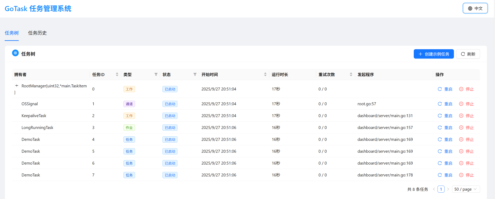

# GoTask

<div align="center">
  
</div>

[English](README.md) | 中文文档

[](https://golang.org/)
[](https://opensource.org/licenses/MIT)
[](https://goreportcard.com/report/github.com/langhuihui/gotask)
[](https://godoc.org/github.com/langhuihui/gotask)

> 一个基于 Go 语言的异步任务管理框架，提供类似操作系统任务管理器的精确控制能力

## 目录

- [项目目的](#项目目的)
  - [核心理念](#核心理念)
  - [解决的核心问题](#解决的核心问题)
  - [九大核心特性](#九大核心特性)
  - [适用场景](#适用场景)
- [快速开始](#快速开始)
  - [安装](#安装)
  - [构建选项](#构建选项)
  - [基本使用](#基本使用)
  - [RootManager 使用说明](#rootmanager-使用说明)
  - [管理面板](#管理面板)
- [AI IDE 规则](#ai-ide-规则)
- [项目结构](#项目结构)
- [功能特性](#功能特性)
  - [九大核心特性](#九大核心特性-1)
  - [九大核心特性详解](#九大核心特性详解)
- [使用指南](#使用指南)
  - [条件编译参数](#条件编译参数)
  - [任务启动](#任务启动)
  - [EventLoop 机制](#eventloop-机制)
  - [任务停止](#任务停止)
  - [任务管理API](#任务管理api)
  - [竞态条件处理](#竞态条件处理)
- [管理面板](#管理面板-1)
  - [后端服务 (dashboard/server)](#后端服务-dashboardserver)
  - [前端界面 (dashboard/web)](#前端界面-dashboardweb)
  - [快速开始](#快速开始-1)
  - [项目结构说明](#项目结构说明)
  - [一键启动](#一键启动)
- [教学课程](#教学课程)
  - [课程结构](#课程结构)
  - [如何使用课程](#如何使用课程)
  - [课程特色](#课程特色)
  - [学习建议](#学习建议)
- [贡献](#贡献)
  - [贡献方式](#贡献方式)
- [许可证](#许可证)
- [致谢](#致谢)
- [相关链接](#相关链接)
- [支持](#支持)

## 项目目的

GoTask 是一个基于 Go 语言的异步任务管理框架，旨在解决复杂项目中的任务管理难题。我们相信**一切皆任务**，无论是网络连接、数据处理、定时任务还是业务流程，都可以抽象为任务进行统一管理。

### 核心理念

**一切皆任务** - 将复杂的业务逻辑分解为可管理的任务单元，每个任务都有明确的生命周期、执行路径和资源管理。这种设计理念使得系统架构更加清晰，代码更易维护，问题更容易定位。

**类操作系统任务管理器** - GoTask 就像操作系统的任务管理器，可以对项目中不同粒度的逻辑进行精确的关闭和重启控制：
- **进程级控制** - 整个应用或服务的启动、停止、重启
- **服务级控制** - 微服务、数据库连接池、缓存服务等
- **组件级控制** - 网络连接、定时任务、数据处理管道等
- **功能级控制** - 单个业务功能、API端点、数据流处理等

### 解决的核心问题

1. **复杂项目的可观测性** - 在微服务架构和分布式系统中，传统的日志和监控方式往往无法提供完整的执行路径追踪。GoTask 通过任务树结构、执行历史记录和性能监控，为复杂项目提供了全方位的可观测性。

2. **异步系统的并发安全** - 传统的 goroutine 管理方式容易导致竞态条件和资源竞争。GoTask 通过单协程事件循环机制，确保任务在父任务协程中顺序执行，彻底避免并发问题。

3. **复杂项目的资源销毁难题** - 在复杂项目中，最难处理的是异步任务的资源销毁，包括销毁顺序、竞态条件、级联销毁等问题。GoTask 通过以下机制彻底解决了这些难题：
   - **优化销毁** - 自动管理资源销毁顺序，避免依赖关系冲突
   - **自动级联销毁** - 父任务销毁时自动触发所有子任务的销毁，确保资源完全释放
   - **关联销毁** - 支持任务间的关联销毁，当关键任务停止时自动停止相关任务
   - **竞态安全** - 通过单协程机制确保销毁过程的线程安全

4. **系统稳定性保障** - 通过优雅关闭、异常处理、重试机制等特性，确保系统在各种异常情况下都能保持稳定运行。

### 九大核心特性

GoTask 通过以下九大特性，为复杂项目提供了完整的任务管理解决方案：

1. **将在父任务协程中被调用** - 避免并发问题，确保任务执行的可预测性
2. **优雅关闭** - 支持资源的正确释放和系统稳定性，实现优化销毁、自动级联销毁和关联销毁
3. **拥有唯一的ID** - 实现完整的任务生命周期追踪
4. **可衡量调用耗时** - 提供精确的性能监控和分析
5. **可扩展** - 支持各种业务场景的灵活定制
6. **可追溯** - 提供完整的执行路径和调用栈追踪
7. **兜底机制** - 完善的异常处理和错误恢复
8. **可选的重试机制** - 智能化的故障恢复策略
9. **可存入历史记录** - 支持任务执行历史的查询和分析

### 适用场景

- **微服务架构** - 服务间的任务协调和生命周期管理
- **流媒体处理** - 音视频流的接收、处理和转发任务
- **数据管道** - 复杂的数据处理流程管理
- **定时任务系统** - 可靠的定时任务调度和执行
- **网络服务** - HTTP、WebSocket、RTMP等网络服务的生命周期管理
- **监控系统** - 系统健康检查和性能监控任务
- **热更新系统** - 类似操作系统任务管理器，支持不同粒度组件的热更新和重启
- **故障恢复** - 自动检测和恢复故障组件，实现系统自愈能力

GoTask 不仅是一个任务管理框架，更是一种架构思想，帮助开发者构建更加稳定、可观测、易维护的复杂系统。

## 快速开始

### 安装

```bash
go get github.com/langhuihui/gotask
```

### 构建选项

GoTask 支持条件编译来控制 panic 行为：

```bash
# 默认模式 - 生产环境推荐
go build

# Panic 模式 - 开发调试使用
go build -tags taskpanic
```

### 基本使用

```go
package main

import (
    "github.com/langhuihui/gotask"
    "time"
)

// 定义一个简单的任务
type MyTask struct {
    task.Task
    Name string
}

func (t *MyTask) Start() error {
    t.Info("任务启动", "name", t.Name)
    return nil
}

func (t *MyTask) Run() error {
    // 执行任务逻辑
    time.Sleep(5 * time.Second)
    return nil
}

func (t *MyTask) Dispose() {
    t.Info("任务清理", "name", t.Name)
}

// 使用gotask项目的根任务管理器
type TaskManager = task.RootManager[uint32, *MyTask]

func main() {
    // 创建根任务管理器
    root := &TaskManager{}
    root.Init()
    
    // 创建并启动任务
    myTask := &MyTask{Name: "示例任务"}
    root.AddTask(myTask)
    
    // 等待任务完成
    myTask.WaitStopped()
}
```

### RootManager 使用说明

**重要**: 使用任务系统时必须使用 `RootManager` 作为根任务管理器。`RootManager` 提供了以下功能：

1. **自动信号处理**: 自动处理操作系统信号（SIGHUP, SIGINT, SIGTERM, SIGQUIT）
2. **优雅关闭**: 提供 `Shutdown()` 方法实现优雅关闭
3. **任务管理**: 作为所有任务的根节点，管理整个任务树的生命周期

**使用步骤**:

1. **创建RootManager实例**:
```go
type TaskManager = task.RootManager[uint32, *MyTask]
root := &TaskManager{}
root.Init()
```

2. **添加任务**:
```go
myTask := &MyTask{Name: "示例任务"}
root.AddTask(myTask)
```

4. **优雅关闭**:
```go
// 程序退出时调用
root.Shutdown()
```

### 管理面板

启动内置的管理面板来可视化监控任务：

```bash
# 启动后端服务
cd dashboard/server
go run main.go

# 启动前端界面
cd dashboard/web
pnpm install
pnpm run dev
```

访问 `http://localhost:5173` 查看任务管理界面。



---

本项目包含了一个独立的任务库（`github.com/langhuihui/gotask`）、一个基于 React 的管理界面和一个示例后端程序。

## AI IDE 规则

项目包含了 AI IDE 规则文件，帮助 AI 助手理解项目结构和开发指南：

| 文件 | 描述 | 用途 |
|------|------|------|
| `ai_rules/Claude.md` | GoTask 项目的 Claude AI 规则 | 为 AI 助手提供 GoTask 框架的架构原则、任务类型、实现模式和最佳实践的全面指南 |
| `ai_rules/.github/copilot-rules.md` | GoTask 项目的 GitHub Copilot 规则 | 为 GitHub Copilot 生成符合 GoTask 规范的代码，包括任务类型选择、生命周期管理和反模式避免 |
| `ai_rules/.cursor/rules/task.mdc` | GoTask 项目的 Cursor AI 规则 | Cursor AI 的 GoTask 开发指南，包括任务层次结构、单协程事件循环和资源管理模式 |
| `ai_rules/.trae/rules/task.md` | GoTask 项目的 Trae AI 规则 | Trae AI 助手的 GoTask 框架规则，涵盖任务执行模型、错误处理和常见用例 |
| `ai_rules/.windsurf/workflows/task.md` | GoTask 项目的 Windsurf AI 规则 | Windsurf AI 的 GoTask 开发工作流规则，包括实现模式、仪表板集成和构建指南 |
| `ai_rules/.codebuddy/.rules/task.mdc` | GoTask 项目的 CodeBuddy（腾讯）规则 | CodeBuddy AI 助手的 GoTask 框架规则，包括任务类型系统、实现模式和开发指南 |
| `ai_rules/.qoder/rules/task.md` | GoTask 项目的 Qoder AI 规则 | Qoder AI 助手的 GoTask 框架规则，涵盖任务执行模型、错误处理和常见用例 |
| `ai_rules/.kiro/steering/task.md` | GoTask 项目的 Kiro AI 规则 | Kiro AI 助手的 GoTask 框架规则，包括任务层次结构、资源管理和反模式避免 |
| `ai_rules/.augment-guidelines` | GoTask 项目的 Augment AI 规则 | Augment AI 助手的 GoTask 框架规则，涵盖实现模式、仪表板集成和构建指南 |

## 项目结构

```
gotask/
├── task.go                 # 核心任务实现
├── job.go                  # 任务容器
├── event_loop.go           # 事件循环
├── work.go                 # 工作任务
├── channel.go              # 通道任务
├── root.go                 # 根任务管理器
├── panic.go                # 非panic模式配置
├── panic_true.go           # panic模式配置
├── task_test.go            # 任务测试文件
├── go.mod                  # Go 模块文件
├── ai_rules/               # AI IDE 规则文件
│   ├── Claude.md           # Claude AI 助手规则
│   ├── .github/
│   │   └── copilot-rules.md # GitHub Copilot 规则
│   ├── .cursor/
│   │   └── rules/
│   │       └── task.mdc    # Cursor AI 规则
│   ├── .trae/
│   │   └── rules/
│   │       └── task.md     # Trae AI 规则
│   ├── .windsurf/
│   │   └── workflows/
│   │       └── task.md     # Windsurf AI 规则
│   ├── .codebuddy/
│   │   └── .rules/
│   │       └── task.mdc    # CodeBuddy AI 规则
│   ├── .qoder/
│   │   └── rules/
│   │       └── task.md     # Qoder AI 规则
│   ├── .kiro/
│   │   └── steering/
│   │       └── task.md     # Kiro AI 规则
│   └── .augment-guidelines # Augment AI 规则
├── util/
│   └── promise.go          # Promise 实现
├── lessons_CN/                # 教学课程
└── dashboard/
    ├── server/             # 后端管理服务
    └── web/                # React 前端管理界面
```

## 功能特性

### 九大核心特性

1. **将在父任务协程中被调用** - 所有子任务在父任务协程中顺序执行，避免并发问题
2. **优雅关闭** - 支持任务的优雅停止和资源清理，确保系统稳定性
3. **拥有唯一的ID** - 每个任务都有唯一标识符，便于追踪和管理
4. **可衡量调用耗时** - 内置性能监控，精确测量任务执行时间
5. **可扩展** - 支持钩子机制和方法重写，提供灵活的扩展能力
6. **可追溯** - 提供广义调用栈，支持任务执行路径追踪
7. **兜底机制** - 错误可以被拦截和处理，提供完善的异常处理
8. **可选的重试机制** - 支持任务失败后的自动重试，可配置重试策略
9. **可存入历史记录** - 任务执行历史可以被记录和查询

### 九大核心特性详解

#### 1. 将在父任务协程中被调用
**业务痛点**: 在复杂的异步系统中，子任务的并发执行往往导致资源竞争、状态不一致等问题。传统的goroutine管理方式难以控制执行顺序，容易出现数据竞态条件。

**实现原理**: GoTask采用单协程事件循环模式，所有子任务的Start()和Dispose()方法都在父任务的专用协程中顺序执行。通过EventLoop机制，确保同一父任务下的子任务永远不会并发执行。

**核心概念**:
- **宏任务（父任务）**: 可以包含多个子任务的执行，本身也是一个任务
- **子任务协程**: 每一个宏任务都会启动一个协程，用来执行子任务的 Start、Run、Dispose 方法
- **懒加载**: 协程可能不会一开始就创建，只有在有子任务时才会创建

**代码示例**:
```go
// 连接管理器（父任务）
type Connection struct {
    task.Job  // Job可包含子任务，子任务全部结束后，Job会结束
    Plugin     *Plugin
    StreamPath string
    RemoteURL  string
    HTTPClient *http.Client
}

// 心跳检测任务（子任务）
type HeartbeatTask struct {
    task.TickTask
    connection *Connection
    interval   time.Duration
}

func (h *HeartbeatTask) GetTickInterval() time.Duration {
    return h.interval
}

func (h *HeartbeatTask) Start() error {
    // 在父任务协程中启动
    h.Info("心跳检测任务启动", "url", h.connection.RemoteURL)
    return nil
}

func (h *HeartbeatTask) Dispose() {
    // 在父任务协程中清理
    h.Info("心跳检测任务清理", "url", h.connection.RemoteURL)
}

// 使用示例
conn := &Connection{RemoteURL: "rtmp://example.com/live/stream"}
heartbeat := &HeartbeatTask{connection: conn, interval: 30*time.Second}
conn.AddTask(heartbeat)
// 心跳任务会在连接管理器的协程中顺序执行
```

**解决价值**: 
- 彻底避免并发访问共享资源的问题
- 简化了复杂异步逻辑的调试和维护
- 保证了任务执行的可预测性和一致性
- 减少了锁的使用，提高了系统性能

#### 2. 优雅关闭
**业务痛点**: 系统关闭时，正在执行的任务可能被强制中断，导致资源泄露、数据不一致等问题。特别是在处理网络连接、文件操作等需要清理资源的场景中，粗暴的进程终止会造成严重后果。

**实现原理**: 通过context.Context机制实现优雅关闭。当父任务收到停止信号时，会依次调用所有子任务的Stop()方法，等待所有子任务完成资源清理后再退出。EventLoop会检测context取消信号，确保所有任务都能正确执行Dispose()方法。

**资源销毁优化机制**:
- **优化销毁顺序**: 框架自动管理任务销毁顺序，确保依赖关系正确，避免资源泄露
- **自动级联销毁**: 父任务销毁时自动触发所有子任务的销毁，无需手动管理复杂的依赖关系
- **关联销毁**: 支持任务间的关联销毁，当关键任务停止时自动停止相关任务，避免孤立任务
- **竞态安全**: 通过单协程机制确保销毁过程的线程安全，彻底避免销毁过程中的竞态条件

**等待机制**: 通过WaitStarted()和WaitStopped()方法来实现等待任务开始和结束。这种方式会阻塞当前协程，确保任务状态的同步。

**代码示例**:
```go
// SRT接收器任务
type Receiver struct {
    task.Task
    mpegts.MpegTsStream
    srt.Conn
}

func (r *Receiver) Start() error {
    // 建立SRT连接和内存分配器
    r.Allocator = util.NewScalableMemoryAllocator(1 << util.MinPowerOf2)
    r.Using(r.Allocator, r.Publisher)
    // 设置连接关闭钩子
    r.OnStop(r.Conn.Close)
    return nil
}

func (r *Receiver) Dispose() {
    // 优雅关闭SRT连接
    if r.Conn != nil {
        r.Conn.Close()
    }
    // 框架自动处理子任务的级联销毁，无需手动管理
}

// 服务器优雅关闭
func (s *Server) OnStop() {
    // 设置停止钩子，3秒后退出
    s.Servers.OnStop(func() {
        time.AfterFunc(3*time.Second, exit)
    })
    // 设置清理钩子
    s.Servers.OnDispose(exit)
}

// 等待任务完成
func waitForReceiver() {
    receiver := &Receiver{}
    receiver.Start()
    
    // 等待任务开始
    receiver.WaitStarted()
    
    // 等待任务结束
    receiver.WaitStopped()
}
```

**解决价值**:
- 保证系统关闭时所有资源都能正确释放
- 避免数据丢失和状态不一致
- 支持热重启和滚动更新
- 提高了系统的可靠性和稳定性
- **彻底解决复杂项目的资源销毁难题** - 自动管理销毁顺序，避免依赖关系冲突
- **简化资源管理复杂度** - 无需手动管理复杂的任务依赖关系和销毁顺序
- **防止资源泄露** - 通过级联销毁确保所有相关资源都能正确释放

#### 3. 拥有唯一的ID
**业务痛点**: 在微服务架构中，任务追踪和问题定位非常困难。当系统出现问题时，很难快速定位到具体的任务实例，特别是在分布式环境中，缺乏统一的标识体系。

**实现原理**: 每个任务在创建时都会分配一个全局唯一的ID，这个ID在整个任务生命周期中保持不变。通过ID可以追踪任务的创建、执行、停止等各个阶段的状态变化。

**代码示例**:
```go
// 发布者任务
type Publisher struct {
    task.Task
    StreamPath string
    RemoteAddr string
    Type       string
}

func (p *Publisher) Start() error {
    // 每个发布者都有唯一的ID
    p.Info("发布者启动", "streamPath", p.StreamPath, "taskId", p.GetID())
    return nil
}

// 获取流路径作为唯一标识
func (p *Publisher) GetKey() string {
    return p.StreamPath
}

// 任务ID可以用于日志追踪
func (p *Publisher) Run() error {
    p.Info("发布者运行中", "streamPath", p.StreamPath, "taskId", p.GetID())
    return nil
}

// 使用示例
publisher := &Publisher{
    StreamPath: "/live/stream1",
    RemoteAddr: "192.168.1.100:8080",
    Type:       "rtmp",
}
// 框架自动为任务分配唯一ID，可用于追踪
```

**解决价值**:
- 实现了完整的任务生命周期追踪
- 支持分布式系统的任务关联分析
- 便于性能监控和问题诊断
- 为审计和合规提供了基础数据

#### 4. 可衡量调用耗时
**业务痛点**: 性能问题往往难以定位，特别是在复杂的异步系统中，很难准确测量每个组件的执行时间。传统的性能分析工具在异步场景下效果有限。

**实现原理**: 框架在任务的关键节点自动记录时间戳，包括任务开始、结束、重试等时间点。通过内置的时间测量机制，可以精确统计每个任务的执行耗时，支持毫秒级精度。

**代码示例**:
```go
// SRT发送器任务
type Sender struct {
    task.Task
    hls.TsInMemory
    srt.Conn
    Subscriber *m7s.Subscriber
}

func (s *Sender) Start() error {
    // 框架自动记录开始时间
    s.SetAllocator(util.NewScalableMemoryAllocator(1 << util.MinPowerOf2))
    s.Using(s.GetAllocator(), s.Subscriber)
    s.OnStop(s.Conn.Close)
    return nil
}

func (s *Sender) Run() error {
    // 执行媒体流处理，可能耗时较长
    pesAudio, pesVideo := mpegts.CreatePESWriters()
    return m7s.PlayBlock(s.Subscriber, func(audio *format.Mpeg2Audio) error {
        // 处理音频数据
        return nil
    }, func(video *mpegts.VideoFrame) error {
        // 处理视频数据
        return nil
    })
}

func (s *Sender) Dispose() {
    // 框架自动记录结束时间，可以获取总耗时
    duration := s.GetDuration()
    s.Info("SRT发送器执行完成", "duration", duration)
}
```

**解决价值**:
- 快速识别性能瓶颈和热点代码
- 支持实时性能监控和告警
- 为系统优化提供数据支撑
- 帮助制定合理的超时和重试策略

#### 5. 可扩展
**业务痛点**: 不同的业务场景需要不同的任务处理逻辑，但传统的任务框架往往缺乏足够的扩展性。开发者需要在框架限制和业务需求之间做出妥协。

**实现原理**: 通过Go的接口和嵌入机制，支持多种任务类型的继承和扩展。提供丰富的钩子方法（OnStart、OnBeforeDispose、OnDispose），允许开发者在任务的关键节点插入自定义逻辑。

**任务类型体系**:
- `task.Task` - 所有任务的基类，定义了任务的基本属性和方法
- `task.Job` - 可包含子任务，子任务全部结束后，Job会结束
- `task.Work` - 同Job，但子任务结束后，Work会继续执行
- `task.ChannelTask` - 自定义信号的任务，通过覆盖GetSignal方法来实现
- `task.TickTask` - 定时任务，继承自ChannelTask，通过覆盖GetTickInterval方法来控制定时器间隔

**任务生命周期方法**:
- `Start() error` - 任务启动方法，用于资源创建（可选）
- `Run() error` - 任务执行过程，阻塞式执行（可选）
- `Go() error` - 非阻塞式执行（可选）
- `Dispose()` - 任务销毁过程，用于资源清理（可选）

**代码示例**:
```go
// 流管理器（Job类型）
type StreamManager struct {
    task.Job  // 可包含子任务，子任务全部结束后，Job会结束
    StreamPath string
    Publishers util.Collection[string, *Publisher]
    Subscribers util.Collection[string, *Subscriber]
}

// 统计任务（定时任务）
type StatsTask struct {
    task.TickTask
    manager  *StreamManager
    interval time.Duration
}

func (s *StatsTask) GetTickInterval() time.Duration {
    return s.interval
}

// 清理任务（定时任务）
type CleanupTask struct {
    task.TickTask
    manager *StreamManager
}

func (c *CleanupTask) GetTickInterval() time.Duration {
    return 5 * time.Minute
}

// 钩子方法
func (s *StreamManager) OnStart() {
    s.Info("流管理器启动前的钩子")
}

func (s *StreamManager) OnDispose() {
    s.Info("流管理器销毁后的钩子")
}

// 任务启动方法
func (s *StreamManager) Start() error {
    // 初始化流管理器资源
    s.Publishers = util.NewCollection[string, *Publisher]()
    s.Subscribers = util.NewCollection[string, *Subscriber]()
    return nil
}

// 任务执行过程
func (s *StreamManager) Run() error {
    // 执行流管理逻辑，会阻塞父任务的子任务协程
    return nil
}

// 任务销毁过程
func (s *StreamManager) Dispose() {
    // 清理所有发布者和订阅者
    s.Publishers.Range(func(key string, pub *Publisher) {
        pub.Stop()
    })
    s.Subscribers.Range(func(key string, sub *Subscriber) {
        sub.Stop()
    })
}
```

**解决价值**:
- 支持各种复杂的业务场景
- 提供了灵活的定制化能力
- 减少了重复代码的编写
- 保持了框架的简洁性和易用性

#### 6. 可追溯
**业务痛点**: 在复杂的异步系统中，当出现问题时很难追踪到具体的执行路径。传统的日志记录方式在异步场景下往往信息不完整，难以重现问题场景。

**实现原理**: 通过维护任务调用栈和状态变化历史，记录每个任务的完整执行路径。包括任务的创建、启动、执行、停止等各个阶段，以及任务之间的父子关系。

**代码示例**:
```go
// RTMP客户端任务
type RTMPClient struct {
    task.Task
    URL      string
    StreamPath string
    direction int
    pullCtx  *PullJob
}

func (c *RTMPClient) Start() error {
    // 框架自动记录调用栈和任务关系
    c.Info("RTMP客户端启动", "url", c.URL, "taskId", c.GetID())
    return nil
}

func (c *RTMPClient) Run() error {
    // 可以获取完整的执行路径和任务层次关系
    c.Info("RTMP客户端执行中", "path", c.GetExecutionPath())
    
    // 执行RTMP连接逻辑
    if err := c.connect(); err != nil {
        c.Error("RTMP连接失败", "err", err)
        return err
    }
    
    return nil
}

// 使用步骤追踪
func (c *RTMPClient) connect() error {
    // 记录执行步骤
    c.Step("URLParsing", "解析RTMP URL")
    c.Step("Connection", "连接到RTMP服务器")
    c.Step("Handshake", "执行RTMP握手")
    c.Step("Streaming", "接收媒体流")
    return nil
}
```

**解决价值**:
- 提供了完整的执行路径追踪
- 支持问题场景的精确重现
- 便于系统行为的分析和优化
- 为故障排查提供了强有力的工具

#### 7. 兜底机制
**业务痛点**: 异步系统中的panic和异常往往难以处理，一个任务的崩溃可能导致整个系统不稳定。传统的异常处理机制在异步场景下效果有限。

**实现原理**: 通过recover机制捕获panic，将异常转换为错误信息向上传播。同时提供多种错误处理策略，包括重试、降级、熔断等，确保系统的稳定性。

**条件编译支持**: 通过 `taskpanic` 构建标签可以控制 panic 行为：
- **默认模式** (`!taskpanic`): panic 被捕获并转换为错误，适合生产环境
- **调试模式** (`taskpanic`): panic 直接抛出，便于开发调试

**代码示例**:
```go
// SRT接收器任务（带异常处理）
type Receiver struct {
    task.Task
    mpegts.MpegTsStream
    srt.Conn
}

func (r *Receiver) Run() error {
    defer func() {
        if r := recover(); r != nil {
            // 框架自动捕获panic并转换为错误
            r.Error("SRT接收器发生panic", "panic", r)
        }
    }()
    
    // 可能发生panic的媒体流处理
    for !r.IsStopped() {
        packet, err := r.ReadPacket()
        if err != nil {
            return err
        }
        
        // 处理媒体包，可能发生panic
        err = r.Feed(bytes.NewReader(packet.Data()))
        if err != nil {
            return err
        }
    }
    
    return r.StopReason()
}

// 服务器级别的异常处理
func (s *Server) Start() error {
    defer func() {
        if r := recover(); r != nil {
            s.Error("服务器启动异常", "panic", r)
            // 执行恢复逻辑
        }
    }()
    
    // 服务器启动逻辑
    return nil
}
```

**解决价值**:
- 防止单个任务的异常影响整个系统
- 提供了完善的错误恢复机制
- 支持优雅降级和熔断保护
- 大大提高了系统的健壮性

#### 8. 可选的重试机制
**业务痛点**: 网络请求、数据库操作等外部依赖经常出现临时性失败，但缺乏统一的重试策略。手动实现重试逻辑既复杂又容易出错。

**实现原理**: 提供可配置的重试策略，支持设置最大重试次数、重试间隔、退避算法等。支持不同错误类型的差异化重试策略，以及特定错误类型的重试终止。

**重试机制详解**:
- **触发条件**: 
  - 当Start失败时，会重试调用Start直到成功
  - 当Run或者Go失败时，则会先调用Dispose释放资源后再调用Start开启重试流程
- **终止条件**:
  - 当重试次数满了之后就不再重试了
  - 当Start或者Run、Go返回ErrStopByUser、ErrExit、ErrTaskComplete时，则终止重试
- **配置方法**: 通过SetRetry(maxRetry int, retryInterval time.Duration)设置重试策略

**代码示例**:
```go
// HTTP文件拉流任务（带重试机制）
type HTTPFilePuller struct {
    task.Task
    PullJob PullJob
    URL     string
    MaxRetry int
    RetryInterval time.Duration
}

func (h *HTTPFilePuller) Start() error {
    // 配置重试策略：最多重试3次，间隔5秒
    h.SetRetry(h.MaxRetry, h.RetryInterval)
    return nil
}

func (h *HTTPFilePuller) Run() error {
    // 可能失败的HTTP拉流操作
    if err := h.pullHTTPStream(); err != nil {
        h.Error("HTTP拉流失败", "url", h.URL, "err", err)
        return err
    }
    return nil
}

// WebSocket连接任务（无限重试）
type WebSocketClient struct {
    task.Task
    URL string
}

func (w *WebSocketClient) Start() error {
    // 配置无限重试，间隔1秒
    w.SetRetry(-1, time.Second)
    return nil
}

// 重试过程中的资源管理
func (h *HTTPFilePuller) Dispose() {
    // 每次重试前会调用此方法清理资源
    if h.PullJob.Connection != nil {
        h.PullJob.Connection.Close()
    }
    h.Info("清理HTTP连接，准备重试")
}
```

**解决价值**:
- 自动处理临时性故障
- 提高了系统的可用性和稳定性
- 减少了手动重试逻辑的复杂性
- 支持智能化的重试策略

#### 9. 可存入历史记录
**业务痛点**: 任务执行历史对于系统监控、问题诊断、性能分析等非常重要，但传统的任务框架往往缺乏历史记录功能。

**实现原理**: 自动记录任务执行的关键信息，包括任务ID、执行时间、状态变化、错误信息等。支持历史数据的查询和分析，为系统监控提供数据支撑。

**代码示例**:
```go
// 推流任务（带历史记录）
type Pusher struct {
    task.Task
    StreamPath string
    URL        string
    MaxRetry   int
}

func (p *Pusher) Start() error {
    // 设置任务描述，用于历史记录
    p.SetDescriptions(task.Description{
        "plugin":     "rtmp",
        "streamPath": p.StreamPath,
        "url":        p.URL,
        "maxRetry":   p.MaxRetry,
    })
    return nil
}

func (p *Pusher) Run() error {
    // 框架自动记录执行历史
    p.Info("开始推流", "url", p.URL)
    return nil
}

// 服务器任务历史记录
func (s *Server) Start() error {
    // 设置服务器描述
    s.SetDescriptions(task.Description{
        "version": Version,
        "port":    s.HTTP.Port,
    })
    
    // 设置钩子记录关键事件
    s.OnStart(func() {
        s.Info("服务器启动完成")
    })
    
    s.OnDispose(func() {
        s.Info("服务器关闭")
    })
    
    return nil
}

// 查询任务历史记录
func queryTaskHistory() {
    history := task.GetTaskHistory()
    for _, record := range history {
        fmt.Printf("任务ID: %s, 执行时间: %v, 状态: %s, 描述: %v\n", 
            record.ID, record.Duration, record.Status, record.Description)
    }
}
```

**解决价值**:
- 支持完整的任务执行历史追踪
- 为系统监控和告警提供数据基础
- 支持性能分析和容量规划
- 满足了审计和合规的要求


## 使用指南

### 条件编译参数

GoTask 支持通过 `taskpanic` 构建标签来控制 panic 行为：

#### 默认模式 (不指定 taskpanic)
```bash
go build
```
- `ThrowPanic = false` - 任务中的 panic 会被捕获并转换为错误
- 提供更好的错误处理和系统稳定性
- 适合生产环境使用

#### Panic 模式 (指定 taskpanic)
```bash
go build -tags taskpanic
```
- `ThrowPanic = true` - 任务中的 panic 会直接抛出
- 便于调试和问题定位
- 适合开发环境使用

#### 使用示例
```go
// 在代码中可以通过 ThrowPanic 变量控制行为
if ThrowPanic {
    panic("这是一个 panic")
} else {
    return errors.New("这是一个错误")
}
```

### 任务启动
任务通过调用父任务的 AddTask 来启动，此时会进入队列中等待启动，父任务的 EventLoop 会接受到子任务，然后调用子任务的 Start 方法进行启动操作。

**重要原则**: 不可以直接主动调用任务的 Start 方法。Start 方法必须是被父任务调用。

### EventLoop 机制
**懒加载设计**: 为了节省资源，EventLoop 在没有子任务时不会创建协程，一直等到有子任务时才会创建，并且如果这个子任务也是一个空的 Job（即没有 Start、Run、Go）则仍然不会创建协程。

**自动停止**: 当 EventLoop 中没有待执行的子任务时，会在以下情况退出：
1. 没有待处理的任务且没有活跃的子任务，且父任务的 keepalive() 返回 false
2. EventLoop 的状态被设置为停止状态（-1）

### 任务停止
**主动停止**: 调用任务的 Stop 方法即可停止某个任务，此时该任务会由其父任务的 eventLoop 检测到 context 取消信号然后开始执行任务的 dispose 来进行销毁。

**停止原因**: 通过调用 StopReason() 方法可以检查任务的停止原因。

**Call 方法**: 调用 Job 的 Call 会创建一个临时任务，用来在子任务协程中执行一个函数，通常用来访问 map 等需要防止并发读写的资源。

### 任务管理API

#### Task 公开方法

**基础信息获取**:
- `GetTaskID() uint32` - 获取任务唯一ID
- `GetTaskType() TaskType` - 获取任务类型
- `GetOwnerType() string` - 获取任务所有者类型
- `GetState() TaskState` - 获取任务当前状态
- `GetLevel() byte` - 获取任务层级
- `GetParent() ITask` - 获取父任务
- `GetTask() *Task` - 获取任务对象
- `GetTaskPointer() uintptr` - 获取任务指针地址
- `GetKey() uint32` - 获取任务键值

**状态控制**:
- `Start() error` - 启动任务（由父任务调用）
- `Stop(error)` - 停止任务
- `IsStopped() bool` - 检查任务是否已停止
- `StopReason() error` - 获取停止原因
- `StopReasonIs(errs ...error) bool` - 检查停止原因是否匹配

**等待机制**:
- `WaitStarted() error` - 等待任务启动完成
- `WaitStopped() error` - 等待任务停止完成

**描述信息**:
- `GetDescriptions() map[string]string` - 获取所有描述信息
- `GetDescription(key string) (any, bool)` - 获取指定描述信息
- `SetDescription(key string, value any)` - 设置描述信息
- `RemoveDescription(key string)` - 删除描述信息
- `SetDescriptions(value Description)` - 批量设置描述信息

**重试机制**:
- `SetRetry(maxRetry int, retryInterval time.Duration)` - 设置重试策略
- `ResetRetryCount()` - 重置重试计数
- `GetRetryCount() int` - 获取当前重试次数
- `GetMaxRetry() int` - 获取最大重试次数

**资源管理**:
- `Using(resource ...any)` - 添加资源依赖
- `OnStop(resource any)` - 设置停止时清理的资源
- `OnStart(listener func())` - 设置启动后回调
- `OnDispose(listener func())` - 设置销毁后回调

**日志记录**:
- `Debug(msg string, args ...any)` - 调试日志
- `Info(msg string, args ...any)` - 信息日志
- `Warn(msg string, args ...any)` - 警告日志
- `Error(msg string, args ...any)` - 错误日志
- `Trace(msg string, fields ...any)` - 追踪日志
- `TraceEnabled() bool` - 检查追踪日志是否启用

**任务执行**:
- `RunTask(t ITask, opt ...any) error` - 同步运行子任务
- `GetSignal() any` - 获取任务信号

#### Job 公开方法

**任务管理**:
- `AddTask(t ITask, opt ...any) *Task` - 添加子任务
- `AddDependTask(t ITask, opt ...any) *Task` - 添加依赖任务
- `RangeSubTask(callback func(task ITask) bool)` - 遍历子任务

**事件监听**:
- `OnDescendantsDispose(listener func(ITask))` - 监听后代任务销毁
- `OnDescendantsStart(listener func(ITask))` - 监听后代任务启动

**状态查询**:
- `Blocked() ITask` - 获取被阻塞的任务
- `EventLoopRunning() bool` - 检查事件循环是否运行

**线程安全**:
- `Call(callback func())` - 在子任务协程中执行函数

#### 全局函数

- `GetNextTaskID() uint32` - 获取下一个任务ID
- `FromPointer(pointer uintptr) *Task` - 从指针创建任务对象

### 竞态条件处理
为了确保任务系统的线程安全，我们采取了以下措施：

**状态管理**:
- 使用 `sync.RWMutex` 保护 EventLoop 的状态转换
- `add()` 方法使用读锁检查状态，防止在停止后添加新任务
- `stop()` 方法使用写锁设置状态，确保原子性

**EventLoop 生命周期**:
- EventLoop 只有在状态从 0（ready）转换到 1（running）时才启动新的 goroutine
- 即使状态为 -1（stopped），`active()` 方法仍可被调用以处理剩余任务
- 使用 `hasPending` 标志和互斥锁跟踪待处理任务，避免频繁检查 channel 长度

**任务添加**:
- 添加任务时会检查 EventLoop 状态，如果已停止则返回 `ErrDisposed`
- 使用 `pendingMux` 保护 `hasPending` 标志，避免竞态条件

## 管理面板

### 后端服务 (dashboard/server)

这是一个基于GoTask的管理服务，提供任务系统的可视化管理功能。就像操作系统的任务管理器一样，可以实时监控和管理项目中不同粒度的任务组件。

**项目特点**:
- 使用GoTask管理HTTP服务器生命周期
- 实现了任务监控和管理API
- 支持任务历史记录查询
- 提供RESTful API接口

**启动方式**:
```bash
cd dashboard/server
go mod tidy
go run main.go
```

**API接口**:
- `GET /api/tasks` - 获取所有任务列表
- `GET /api/tasks/{id}` - 获取特定任务详情
- `GET /api/tasks/{id}/history` - 获取任务执行历史
- `POST /api/tasks/{id}/stop` - 停止指定任务

### 前端界面 (dashboard/web)

这是一个基于React + TypeScript的Web管理界面，提供了可视化的任务管理功能。类似Windows任务管理器，可以直观地查看、控制和重启不同粒度的任务组件。

**项目特点**:
- 现代化的React + TypeScript技术栈
- 支持中英文国际化
- 实时任务状态监控
- 任务历史记录可视化
- 响应式设计，支持移动端

**技术栈**:
- React 18 + TypeScript
- Vite 构建工具
- Ant Design UI组件库
- i18next 国际化
- Axios HTTP客户端

**启动方式**:
```bash
cd dashboard/web
pnpm install
pnpm run dev
```

**功能特性**:
- **任务树视图**: 以树形结构展示任务层次关系，类似进程树结构
- **实时监控**: 实时显示任务状态和执行进度，支持CPU、内存等资源监控
- **历史记录**: 查看任务执行历史和性能数据
- **多语言支持**: 支持中文和英文界面
- **响应式设计**: 适配桌面和移动设备
- **任务控制**: 支持启动、停止、重启不同粒度的任务组件
- **资源管理**: 监控和管理任务占用的系统资源

**开发命令**:
```bash
pnpm run dev          # 启动开发服务器
pnpm run build        # 构建生产版本
pnpm run preview      # 预览构建结果
pnpm run lint         # 代码检查
```

### 快速开始

1. **启动后端服务**:
   ```bash
   cd dashboard/server
   go run main.go
   ```

2. **启动前端界面**:
   ```bash
   cd dashboard/web
   pnpm install
   pnpm run dev
   ```

3. **访问管理界面**:
   打开浏览器访问 `http://localhost:5173`

4. **查看API文档**:
   访问 `http://localhost:8080/api/tasks` 查看任务列表

### 项目结构说明

```
dashboard/
├── server/                 # Go后端管理服务
└── web/                   # React前端管理界面
```

### 一键启动

项目提供了便捷的启动脚本：

```bash
# 给脚本执行权限
chmod +x dashboard/start.sh

# 一键启动前后端服务
./dashboard/start.sh
```

该脚本会自动启动后端服务和前端开发服务器，并打开浏览器访问管理界面。

## 教学课程

GoTask 项目提供了完整的教学课程系统，位于 `lessons/` 目录下。该系统包含10个渐进式课程，从基础到高级，帮助开发者全面掌握 GoTask 框架。

### 课程结构

#### 基础课程 (Lesson 1-3)
- **Lesson 1**: 基础Task使用 - 学习最基本的任务定义和执行
- **Lesson 2**: Job容器管理 - 学习如何管理多个子任务
- **Lesson 3**: Work长期运行任务 - 学习异步任务的执行

#### 中级课程 (Lesson 4-6)
- **Lesson 4**: ChannelTask通道任务 - 学习任务间通信
- **Lesson 5**: TickTask定时任务 - 学习定时器任务
- **Lesson 6**: RootManager根任务管理 - 学习应用程序级管理

#### 高级课程 (Lesson 7-9)
- **Lesson 7**: 资源管理与清理 - 学习资源生命周期管理
- **Lesson 8**: 重试机制 - 学习错误恢复策略
- **Lesson 9**: 事件监听与回调 - 学习任务间协作

#### 综合应用 (Lesson 10)
- **Lesson 10**: 综合应用案例 - 完整应用程序示例

### 如何使用课程

1. **按顺序学习**：建议按照课程编号顺序学习，每个课程都建立在前一个课程的基础上

2. **动手实践**：每个课程都包含TODO注释，你需要：
   - 阅读课程说明
   - 按照TODO注释的提示取消注释
   - 运行程序验证结果
   - 理解每个概念的作用

3. **运行课程**：
   ```bash
   # 进入课程目录
   cd lessons/lesson01
   
   # 运行课程
   go run main.go
   ```

### 课程特色

- **渐进式设计**：从简单到复杂，循序渐进
- **实践导向**：每个课程都是可运行的完整程序
- **全面覆盖**：涵盖GoTask框架的所有核心功能
- **错误提示**：当用户未完成TODO时，会显示明确的错误信息

### 学习建议

1. **理解概念**：不要只是取消注释，要理解每个方法的作用和适用场景
2. **实验修改**：尝试修改参数，观察不同的行为，加深理解
3. **查看源码**：结合GoTask框架的源码，理解内部实现机制
4. **构建项目**：学完所有课程后，尝试构建自己的项目

## 贡献

### 贡献方式

- 🐛 报告 Bug
- 💡 提出新功能建议
- 📝 改进文档
- 🔧 提交代码修复
- 🧪 编写测试用例

## 许可证

本项目采用 [MIT 许可证](LICENSE)。

## 致谢

感谢所有为 GoTask 项目做出贡献的开发者和社区成员。

## 相关链接

- [GoDoc 文档](https://godoc.org/github.com/langhuihui/gotask)
- [Go Report Card](https://goreportcard.com/report/github.com/langhuihui/gotask)
- [GitHub Issues](https://github.com/langhuihui/gotask/issues)
- [GitHub Discussions](https://github.com/langhuihui/gotask/discussions)

## 支持

如果你觉得这个项目对你有帮助，请考虑：

- ⭐ 给项目点个 Star
- 🐛 报告问题或建议
- 📢 分享给其他开发者

---

<div align="center">

**GoTask** - 让复杂项目的任务管理变得简单

[快速开始](#快速开始) • [文档](#九大核心特性详解) • [示例](#基本使用) • [管理面板](#管理面板)

</div>