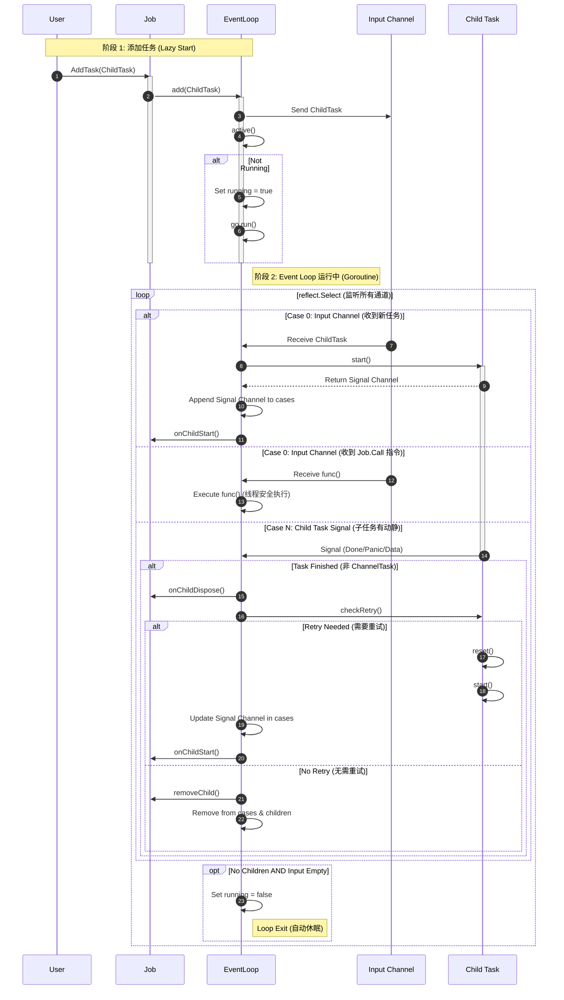

### 图解说明

1.  **Lazy Start (惰性启动)**:
    *   `EventLoop` 并不是一开始就运行的。只有当 `AddTask` 或 `Call` 被调用时，`active()` 方法才会检查并启动 `run()` Goroutine。
    *   如果 Loop 已经在运行，`active()` 只是确保状态正确，不会重复启动。

2.  **Input Channel (Case 0)**:
    *   这是 `reflect.Select` 的第 0 个 case，优先级最高。
    *   它接收两种类型的数据：
        *   `ITask`: 新的子任务，会被启动并加入监听列表。
        *   `func()`: 闭包函数（来自 `Job.Call`），会在 Loop 的 Goroutine 中直接执行，保证了对 Job 内部状态修改的线程安全性。

3.  **Child Task Signal (Case N)**:
    *   当子任务完成或报错时，对应的 Channel 会被触发。
    *   **重试机制**: `EventLoop` 会询问任务 `checkRetry()`。如果返回 `true`，任务会被重置并重新启动，保持在 Loop 中；否则，任务会被彻底移除。

4.  **自动退出**:
    *   当没有子任务在运行 (`len(children) == 0`) 且 Input Channel 为空时，`EventLoop` 会自动退出，释放 Goroutine 资源。下次有任务时再重新启动。
